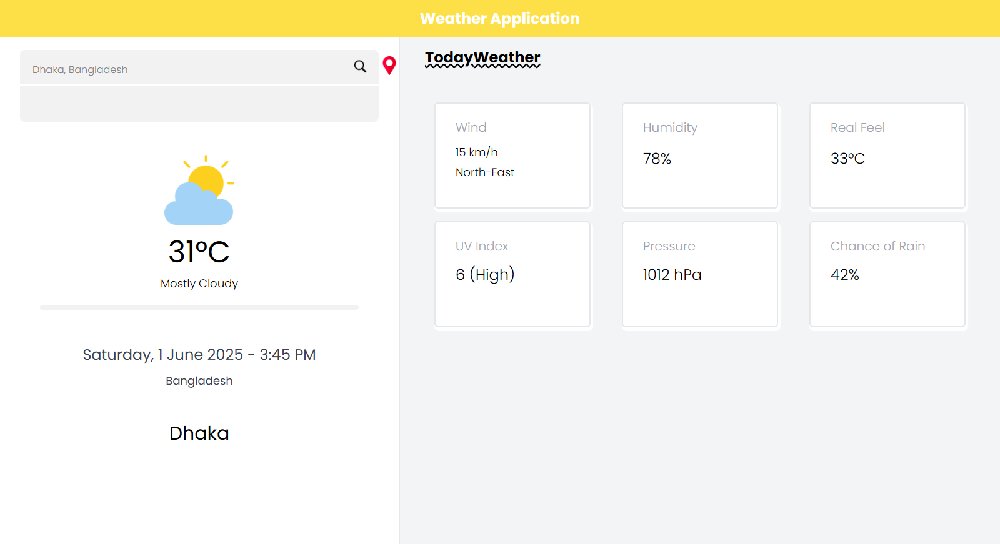

# 🌦️ Weather Search App

A responsive Weather Search web application built using **HTML, CSS, JavaScript, and TailwindCSS**. The app fetches weather data using the [WeatherAPI](https://www.weatherapi.com/) and includes features like:

- 🌍 Current location weather
- 🔍 City-based weather search
- 🕘 Recent search history
- ⚠️ Error handling for invalid or failed searches
- 🔄 Dynamic weather data updates
- 📱 Fully responsive UI

---

## 🚀 Features

- **Search Weather**: Enter any city to get the latest weather updates.
- **Recent Searches**: Stores and displays recently searched cities.
- **Current Location**: Get weather data based on your current geolocation.
- **Responsive Design**: Built with TailwindCSS for modern responsive UI.
- **Error Handling**: Displays user-friendly messages on API failure or incorrect input.
- **Data Update**: Weather data updates dynamically without needing a page refresh.

---

## 📸 Demo

; 

---

## 🛠️ Tech Stack

- **Frontend**: HTML, CSS, JavaScript
- **Styling**: TailwindCSS
- **API**: [WeatherAPI](https://www.weatherapi.com/)

---

## 🔧 How to Run Locally

1. **Clone the Repository**
   ```bash
   git clone https://github.com/your-username/weather-search-app.git
   cd weather-search-app
